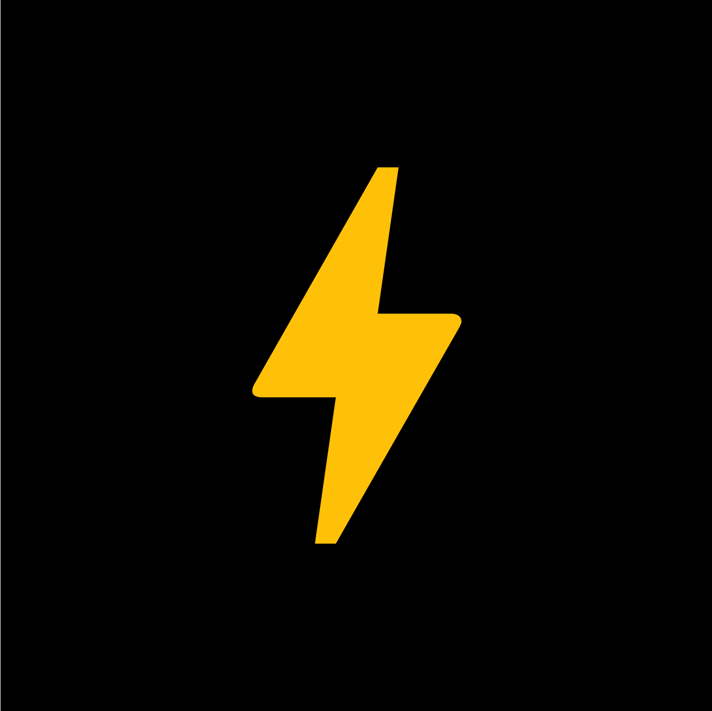

# 🎮 TheGameApp Web Platform

<div align="center">
  
  <br>
  <h3>Master the Art of Social Connections</h3>
  
  [](https://opensource.org/licenses/MIT)
  [](https://developer.mozilla.org/en-US/docs/Web/HTML)
  [](https://developer.mozilla.org/en-US/docs/Web/CSS)
  [](https://developer.mozilla.org/en-US/docs/Web/JavaScript)
  [](https://blog.cleancoder.com/uncle-bob/2012/08/13/the-clean-architecture.html)
</div>

## 📱 About TheGameApp

TheGameApp is a revolutionary platform designed to help users master social connections and improve their dating game. Our AI-powered tools provide personalized strategies, real-time assistance, and progress tracking to enhance your social interactions.

### ✨ Key Features

- **🤖 Smart Response AI**: Get contextually perfect responses for any conversation
- **🎯 Status Bait Creator**: Craft engaging social media updates that spark conversations
- **🔥 Attraction Mastery**: Learn strategic communication techniques for meaningful connections
- **📊 Progress Tracking**: Monitor your social skills improvement with detailed analytics
- **🌐 Multi-language Support**: Available in English and Spanish

## 🏗️ Project Architecture

This project follows **Clean Architecture** principles, ensuring a modular, maintainable, and testable codebase.

<div align="center">
  
</div>

### 📂 Project Structure

```
TheGameAppWeb/
├── domain/               # Business entities and rules
│   ├── entities/         # Core business objects
│   ├── usecases/         # Application-specific business rules
│   └── repositories/     # Data access interfaces
├── infrastructure/       # External frameworks and tools
│   └── repositories/     # Data access implementations
├── interfaces/           # Adapters between layers
│   ├── controllers/      # Request/response handlers
│   └── presenters/       # Data formatters
├── presentation/         # UI components
│   ├── views/            # Application views
│   └── components/       # Reusable UI components
├── public/               # Static assets
│   ├── css/              # Stylesheets
│   ├── js/               # Client-side scripts
│   ├── images/           # Images and icons
│   └── fonts/            # Typography
└── index.html            # Main entry point
```

## 🚀 Getting Started

### Prerequisites

- A modern web browser (Chrome, Firefox, Safari, Edge)
- Basic knowledge of HTML, CSS, and JavaScript
- Git (for cloning the repository)

### Installation

1. **Clone the repository**

   ```bash
   git clone https://github.com/TheGameApp/TheGameAppWeb.git
   cd TheGameAppWeb
   ```

2. **Serve the application**

   Since the application uses ES6 modules, you'll need to serve it through a local web server:

   Using Python:

   ```bash
   python -m http.server 8000
   ```

   Or using Node.js with a package like `serve`:

   ```bash
   npx serve
   ```

3. **Open in your browser**

   Navigate to `http://localhost:8000` (or the port provided by your server)

## 🎨 Design System

TheGameApp uses a consistent design system with carefully selected colors, typography, and components.

### 🎭 Typography

We use the **Clash Display** font family in various weights:

- Clash Display Extralight (200)
- Clash Display Light (300)
- Clash Display Regular (400)
- Clash Display Medium (500)
- Clash Display Semibold (600)
- Clash Display Bold (700)

### 🌈 Color Palette

- **Primary Colors**: Lavender, Cyan, White
- **Secondary Colors**: Gray, Dark Gray
- **Accent Colors**: Red, Yellow, Green

## 🌐 Internationalization

TheGameApp supports multiple languages:

- 🇺🇸 English (default)
- 🇪🇸 Spanish

The application automatically detects the user's browser language and applies the appropriate translations. Users can also manually switch between languages using the language selector in the header.

## 🧩 Clean Architecture Principles

1. **Framework Independence**: The application core doesn't depend on any external frameworks
2. **Testability**: Business rules can be tested without UI, database, or external elements
3. **UI Independence**: The interface can change without affecting the rest of the system
4. **Database Independence**: Storage technology can be swapped without affecting business rules
5. **External Agency Independence**: Business rules know nothing about the outside world

## 👨‍💻 Contributing

We welcome contributions to TheGameApp! Please follow these steps:

1. Fork the repository
2. Create a feature branch (`git checkout -b feature/amazing-feature`)
3. Commit your changes (`git commit -m 'Add some amazing feature'`)
4. Push to the branch (`git push origin feature/amazing-feature`)
5. Open a Pull Request

## 📄 License

This project is licensed under the MIT License - see the LICENSE file for details.

---

<div align="center">
  <p>© 2025 TheGameApp.Com All Rights Reserved</p>
  <p>
    <a href="https://github.com/TheGameApp">GitHub</a> •
    <a href="https://thegameapp.com">Website</a> •
    <a href="mailto:help@thegameapp.com">Contact</a>
  </p>
</div>
